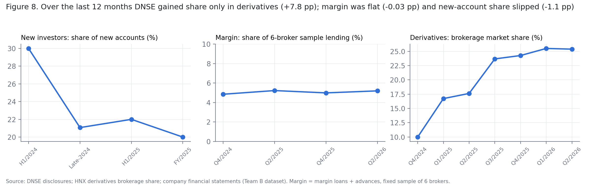
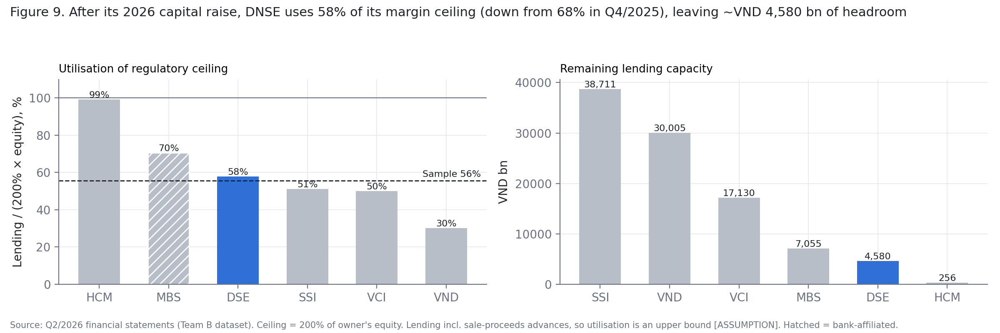
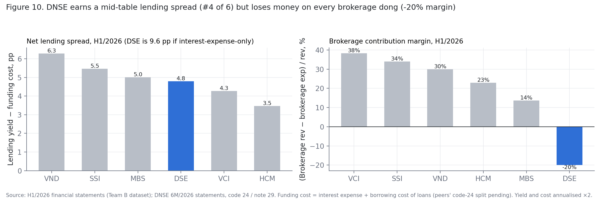

# DNSE client-segment prioritisation – Axis 2 (supply side)

Analysis for **FBA Season 6, Round 2** (DNSE case), Team B.

**Question:** in which client group (new investors, margin borrowers or derivatives traders) does DNSE still have the room and the capability to grow?

The notebook scores each group 1–5 on supply-side measures:
- **Momentum:** 12-month change in DNSE's market share.
- **Headroom:** growth still possible before a binding constraint.
- **Efficiency:** DNSE's rank against five listed peers.

It benchmarks DNSE against SSI, VND, HCM, VCI and MBS, using financial statements, HNX derivatives brokerage shares and company disclosures.

## Pipeline

1. **Extract:** read only the hard-typed input cells from the team's Excel dataset.
2. **Clean:** fix date parsing, mixed definitions and text-in-number cells, logging every change.
3. **Validate:** re-compute every spreadsheet formula in pandas and compare with Excel (81/81 match).
4. **Metrics:** margin-ceiling utilisation and headroom, lending yield vs funding cost, brokerage contribution margin, share momentum.
5. **Score and test:** rule-based 1–5 scores and a sensitivity check (alternative definitions, time windows, dropping each measure).

## Figures

| | |
|---|---|
|  | DSE share by client group |
|  | Margin-ceiling utilisation and remaining headroom, Q2/2026 |
|  | Net lending spread and brokerage contribution margin, H1/2026 |

## Repository layout

```
notebook/B1_axis2_supply_side.ipynb   full analysis (runs with Restart & Run all)
figures/                              exported figures
data/raw/                             place the input dataset here (not included)
requirements.txt
```

## How to run

```bash
pip install -r requirements.txt
# put "FBAR2_TEAM B DATASET.xlsx" in data/raw/  (see data/raw/README.md)
jupyter nbconvert --to notebook --execute --inplace notebook/B1_axis2_supply_side.ipynb
```

The notebook writes its tables to `data/clean/`, and these are not version-controlled.

## Notes

- Money is in VND billion. Ratios are decimals. Share changes are in percentage points.
- The input dataset is competition material, so it is not published.
